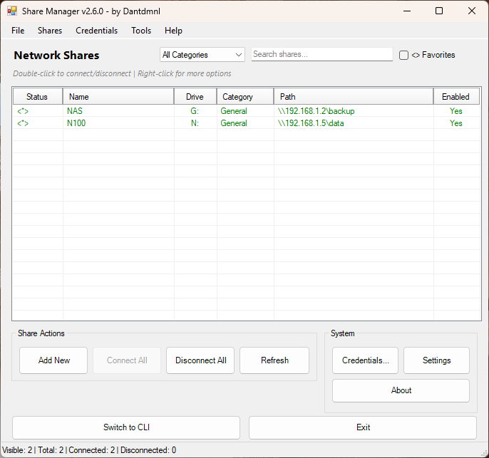
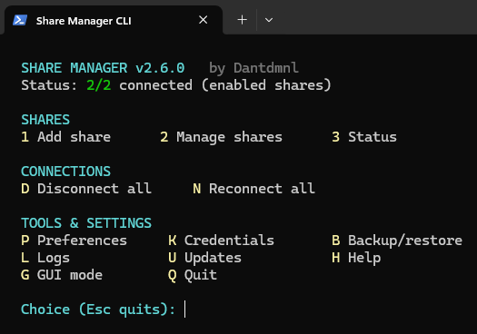

# Share Manager




- **Script version:** 2.6.0
- **Author:** Dantdmnl
- **License:** See [LICENSE](LICENSE)

See [CHANGELOG.md](CHANGELOG.md) for release history.

## Description

Easily manage and map network shares using this PowerShell script with support for both CLI and GUI interfaces. Share Manager is designed for end users who frequently access shared folders on a NAS or file server, providing a simple interface with persistent settings.

## Features

### Core Features

- **Multi-share support** - Manage multiple network shares with different credentials
- **Toggle between CLI and GUI mode** with persistent startup preference
- **Securely save credentials** using Windows DPAPI encryption - tied to your user account
- **Map or unmap shares** individually or all at once with batch operations
- **Test connectivity** before attempting to map shares
- **No administrator permissions required**
- **Persistent mapping** - Automatic reconnection at Windows logon

### Working With Shares

**First-time setup:** In the CLI, add a share, restore a backup, or start with no shares; optional preferences come first. In the GUI, add or restore as many shares as needed, edit or remove mistakes, adjust preferences, then choose **Finish Setup**. You can finish without shares. Closing setup early leaves it unfinished but keeps any shares already saved. Backups do not include passwords, so restored shares need credentials before connecting.

**CLI Add Share:** Enter a path such as `\\server\share` or `\\192.168.1.2\backup`. Invalid server addresses are explained before review; a single-dot correction for an IP-looking address is offered for confirmation, with Yes as the default. At review, the save actions indicate when a password prompt follows. At that prompt, Enter or Escape returns to review with the entered fields intact. A failed connection leaves the saved share available to retry later.

New GUI setups start with the Modern theme. Switching to Classic in Preferences applies to subsequent setup windows and the main GUI. Removing a share from setup does not disconnect an existing drive mapping.

**Categories:** GUI Add/Edit and CLI Edit suggest General, Home, Work, Backups, Media, and Projects. You can still enter a custom category. Suggestions do not create shares or add unused categories to the filter list.

**Credentials:** GUI Add/Edit offers saved usernames; CLI lists them. Select an existing username to reuse its saved credential, or enter a new username and password. Ordinary edits keep usable credentials without another prompt. Credentials remain shared by username, not copied into each share.

- In CLI Edit, enter `/password` at the username prompt to update its saved password immediately. Enter at the password prompt keeps the existing password and continues editing. A username without a usable saved credential still requires a password.
- In GUI Edit, **Change password...** opens the credential dialog immediately. Credential changes save separately from share settings; cancelling the share dialog does not undo a saved password change.
- Replacing a password warns about other shares using that username. Those shares will use the replacement on subsequent connections; existing sessions are not automatically reconnected.
- If credentials cannot be saved, the Add/Edit workflow stops instead of reporting success. The storage format is unchanged.

**Network paths:** GUI Add/Edit trims surrounding whitespace and matching quotes. An accidental backtick and extra separator before the server name produces a correction suggestion requiring confirmation. Characters inside share and folder names are preserved.

**Automatic reconnection:** Run Share Manager normally, without administrator rights, with persistent mapping enabled to regenerate AutoMap after updating. AutoMap attempts configured shares directly, retries transient failures up to three times with 30-second delays, and checks drive access before reporting success. It does not continuously monitor a VPN that connects after the startup retry window.

AutoMap progress and actionable failures are in `%APPDATA%\Share_Manager\LogonScript.log`. Detailed DEBUG events are retained in `LogonScript.events.jsonl`, not the normal text log. Saved credentials must be readable by the Windows account signing in; copying another user's DPAPI credential file is not sufficient.

### Organization and Search

- **Favorites system** - Star your most-used shares for quick access
- **Category organization** - Group shares by Work, Personal, Projects, etc.
- **Smart search** - Instantly filter shares by name, path, or drive letter
- **Multi-criteria filtering** - Combine search, category, and favorites filters
- **Keyboard shortcuts** - `Ctrl+N` (add new), `Ctrl+F` (search), `Ctrl+R` (refresh), `Ctrl+A` (select all visible shares), `Ctrl+Shift+A` (connect all), `Ctrl+D` (disconnect all), `Delete` (remove)

### Analytics and History

- **Connection history** - Track all connection attempts with timestamps
- **Usage statistics** - View connection count and last connected time per share
- **Error tracking** - Last error message stored for troubleshooting
- **Session-based logging** - Trace connection events across script runs

### Credential Management

- **Credential backup/restore** - Export and import encrypted credentials (Merge or Replace modes)
- **Smart credential prompting** - Username autocomplete from credential store
- **Automatic credential prompts** when referencing a non-existent username
- **Recent usernames dropdown** for quick re-entry

### Data Management

- **Import/Export configuration** for backup and portability
- **Automatic backup** before destructive operations (v2.1.1+)
- **Atomic saves** prevent configuration corruption (v2.1.1+)
- **Duplicate-safe imports** with Merge or Replace modes

### Logging and Diagnostics

- **Enhanced connection retry** - Exponential backoff and intelligent error classification
- **Structured logging** - Dual-output logs (text + JSONL) with automatic rotation
- **Log analysis tools** - Query events by category, level, time range, or session
- **Comprehensive error messages** with troubleshooting guidance (v2.1.1+)

### User Experience

- **First-time setup wizard** for guided configuration
- **Real-time status indicators** with connection state and tooltips
- **Batch enable/disable** - Enable or disable multiple shares at once
- **Drive label sync** - Mapped drives labeled with share name in Explorer
- **Reconnect All** operation for quick bulk remapping
- **CLI navigation** - Use the keys shown in each menu or type names and unique prefixes such as `stat` and `pref`. Bulk names require `all`: `connect-all`, `disconnect-all`, `reconnect-all`, or abbreviated forms such as `con a`. In Manage Shares, arrow keys move focus, Enter opens that share's details and actions, Space selects shares for bulk actions, `/` searches, and `?` shows more keys. Selection actions appear only after selecting a share; multi-share and enable/disable actions confirm their target list. In an interactive console, Escape backs out of menus and cancels CLI text/password prompts; at the main menu it exits. Press `:` to switch to the numbered menu; it is also the automatic fallback when interactive key input is unavailable. Disabled shares cannot be connected until enabled. Filters match text literally.

## Updating Share Manager

### AppData and Update Backup Cleanup

Normal Share Manager startup automatically cleans eligible old log archives and updater rollback backups. Cleanup failures are logged without preventing startup. AutoMap alone does not run cleanup.

For a non-destructive preview, run `.\Share_Manager.ps1 -CleanupData`. To apply cleanup manually, run `.\Share_Manager.ps1 -CleanupData -ApplyCleanup`. Both commands exit without opening the GUI or CLI menu; preview mode does not run automatic cleanup.

Cleanup retains the newest two archives per log stream and all archives less than 90 days old. Only recognized, timestamped Share Manager and AutoMap log archives directly inside `%APPDATA%\Share_Manager` are eligible. Active logs, connection history, configuration, credentials, AutoMap scripts, pre-import backups, exported backups, legacy recovery files, and unknown files are preserved.

Updater backups beside the running script have a separate retention rule: keep the newest two plus anything under 90 days old. Only filenames matching `<current-script>.yyyyMMdd-HHmmss.<32-character-GUID>.bak` qualify. Manual `.bak` files and backups for other scripts are untouched. Cleanup runs on subsequent normal launches, not during update installation; the newly created rollback backup is retained. Preview output includes each file's folder.

### Checking for Updates

Use **U - Updates** in the CLI or **Help > Check for Updates** in the GUI. Checks are manual; Share Manager does not contact GitHub at startup or schedule update checks. Installation asks for confirmation.

The updater uses the latest stable release from this repository and its `Share_Manager.ps1` asset. It checks GitHub's SHA-256 asset digest, file size, PowerShell syntax, required application functions, and the version against the release tag. A release missing a digest must be downloaded manually. The digest checks integrity against GitHub metadata; it is not an independent publisher signature.

The current script is replaced atomically, with a timestamped `.bak` file beside it. Local script customizations are replaced, but configurations and saved credentials in `%APPDATA%\Share_Manager` are not changed by the updater. The script folder must be writable. Download or validation failures leave the current script in place. Equal versions and downgrades are refused.

Close and reopen Share Manager after installing. Persistent AutoMap scripts are regenerated through the normal startup flow when persistent mapping is enabled. To roll back, close Share Manager and replace the script with the saved `.bak` copy, retaining the `.ps1` filename. Updater backups follow the cleanup retention rule above; copy a backup to a separate location if you need to retain it indefinitely.

Update checks send a request to GitHub; downloads also use GitHub's asset hosting. No share configuration, usernames, or saved credentials are included. GitHub receives ordinary connection metadata such as your public IP address.

## Prerequisites

- Windows OS with PowerShell 5.1 or higher.
- A reachable NAS or network share location.
- Script execution policy must allow running scripts:

```powershell
Set-ExecutionPolicy -Scope CurrentUser -ExecutionPolicy RemoteSigned
```

## Usage

### Method 1: Download and Run the Script Locally

1. **Download the Script**
   - Visit the [releases tab](https://github.com/Dantdmnl/Share_Manager/releases) on the GitHub repository.
   - Download the latest version of the `Share_Manager.ps1` file.

2. **Run the Script**
   - Locate the downloaded file on your computer.
   - Right-click the file and select **Run with PowerShell**.

3. **Follow the Prompts**
   - The script will provide a menu to guide you through mapping your share, saving preferences, or switching modes.

### Method 2: Create a Desktop Shortcut

1. **Create a Shortcut**
   - Right-click on your Desktop > New > Shortcut.
   - Enter the following as the location:

   ```text
   C:\Windows\System32\WindowsPowerShell\v1.0\powershell.exe -ExecutionPolicy Bypass -STA -File "C:\YourFolder\Share_Manager.ps1"
   ```

   Be sure to replace `YourFolder` with your path.

2. **Customize the Shortcut (Optional)**
   - Name it something like `Share Manager`.
   - Set a custom icon if desired.

3. **Run the Shortcut**
   - Double-click the shortcut to launch the script in your preferred mode (CLI or GUI).

## Security and Privacy

- **DPAPI Encryption**: Credentials are encrypted using Windows Data Protection API (DPAPI), which ties encryption to your user account and machine. Only you can decrypt them.
- **Automatic Migration**: Legacy AES-encrypted credentials (if upgrading from an older version) are automatically migrated to DPAPI on first use. Config files from older versions are automatically upgraded in-memory to add new properties (for example, `Enabled` and `SyncShareNameToDriveLabel`) on every load.
- **GDPR Compliant (v2.4.0+)**:
  - **INFO logs** (default): no personal data logged - operational events only (startup, operations, results).
  - **DEBUG logs** (opt-in): includes usernames, paths, and computer names for troubleshooting when enabled via `$MANUAL_LOG_LEVEL = 'DEBUG'` in script.
  - Personal data protection by design - log level filtering is enforced in code.
  - See [GDPR-COMPLIANCE.md](GDPR-COMPLIANCE.md) for full details on data handling and rights.
- **Password Security (v2.4.0+)**: Special characters in passwords are handled via direct `net use` arguments and prepared Credential Manager targets for persistent mappings.
- **Local Storage Only**: All data (config, credentials, logs) is stored locally under `%APPDATA%\Share_Manager`.
- **Log Rotation**: Automatic cleanup after 30 days or 5MB to prevent indefinite data retention.

## Factory Reset

To completely reset Share Manager and remove all stored data (configuration, credentials, logs):

```powershell
# One-liner to remove all data except the script itself
Remove-Item -Path "$env:APPDATA\Share_Manager" -Recurse -Force -ErrorAction SilentlyContinue; Remove-Item -Path "$env:APPDATA\Microsoft\Windows\Start Menu\Programs\Startup\Share_Manager_AutoMap.*" -Force -ErrorAction SilentlyContinue
```

**Warning:** This will permanently delete:

- All share configurations (`shares.json`)
- All saved credentials (`creds.json`)
- All log files (`.log` and `.events.jsonl`)
- Logon script files (if persistent mapping was enabled)
- Backup files (`.v1.backup`, etc.)

The script file (`Share_Manager.ps1`) remains intact. On next run, first-time setup runs again.

## Migration Notes

**v2.1.1:**

- Config files from older versions are automatically upgraded in-memory to add new properties (for example, `Enabled` and `SyncShareNameToDriveLabel`) on every load.

**v2.0.0:**

- Legacy AES-encrypted credentials (`cred.txt` and `key.bin`) are migrated to DPAPI (`creds.json`) on first run.
- Configuration moves from `config.json` (single-share) to `shares.json` (multi-share).
- Exports never include credentials. Missing credentials are requested when referenced.
- Scripts relying on legacy single-share behavior should be updated for multi-share behavior.

## Development Notes

- PowerShell 5.1+ on Windows is required (GUI uses Windows Forms).
- Linting uses PSScriptAnalyzer with custom settings in `Debug/PSScriptAnalyzerSettings.psd1`.
- See [CONTRIBUTING.md](CONTRIBUTING.md) for developer setup, coding style, and PR guidance.

## Storage Locations

- **Configuration**: `%APPDATA%\Share_Manager\shares.json` (multi-share)
- **Credentials**: `%APPDATA%\Share_Manager\creds.json` (DPAPI-encrypted, multi-user)
- **Logs**:
  - `%APPDATA%\Share_Manager\Share_Manager.log` (human-readable text, auto-rotation)
  - `%APPDATA%\Share_Manager\Share_Manager.events.jsonl` (structured events for analysis)
  - `%APPDATA%\Share_Manager\LogonScript.log` (AutoMap startup script log)
  - `%APPDATA%\Share_Manager\LogonScript.events.jsonl` (AutoMap structured events)
- **Logon Script**: `%APPDATA%\Share_Manager\Share_Manager_AutoMap.ps1`, launched by `Share_Manager_AutoMap.cmd` in the current user's Startup folder (if persistent mapping is enabled).
- **Credential Backups**: `%APPDATA%\Share_Manager\creds_backup_YYYY-MM-DD_HHmmss.json` (when exported)
- **Legacy Files**: `config.json` and `cred.txt` (auto-migrated to v2 format with backups)

## License

This project is licensed under the MIT License. See [LICENSE](LICENSE) for details.

## Author

Developed by **Dantdmnl**.
