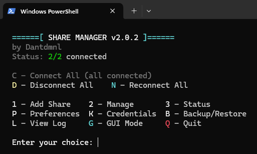

# Share Manager



**Version:** 2.2.0  
**Author:** Dantdmnl  
**License:** See [LICENSE](LICENSE)

## Description
Easily manage and map network shares using this PowerShell script with support for both CLI and GUI interfaces. Share Manager is designed for end users who frequently access shared folders on a NAS or file server, providing a simple interface with persistent settings.

## Features

### Core Features
- **Multi-share support** - Manage multiple network shares with different credentials
- **Toggle between CLI and GUI mode** with persistent startup preference
- **Securely save credentials** using Windows DPAPI encryption - tied to your user account
- **Map or unmap shares** individually or all at once with batch operations
- **Test connectivity** before attempting to map shares
- **No administrator permissions required**
- **Persistent mapping** - Automatic reconnection at Windows logon

### Organization & Search (v2.2.0 ⭐ NEW)
- **Favorites system** - Star your most-used shares for quick access
- **Category organization** - Group shares by Work, Personal, Projects, etc.
- **Smart search** - Instantly filter shares by name, path, or drive letter
- **Multi-criteria filtering** - Combine search, category, and favorites filters
- **Keyboard shortcuts** - `Ctrl+N` (add new), `Ctrl+F` (search), `Ctrl+R` (refresh), `Ctrl+A` (connect all), `Ctrl+D` (disconnect all), `Delete` (remove)

### Analytics & History (v2.2.0 ⭐ NEW)
- **Connection history** - Track all connection attempts with timestamps
- **Usage statistics** - View connection count and last connected time per share
- **Error tracking** - Last error message stored for troubleshooting
- **Session-based logging** - Trace connection events across script runs

### Credential Management
- **Credential backup/restore** - Export and import encrypted credentials (Merge or Replace modes)
- **Smart credential prompting** - Username autocomplete from credential store
- **Automatic credential prompts** when referencing a non-existent username
- **Recent usernames dropdown** for quick re-entry

### Data Management
- **Import/Export configuration** for backup and portability
- **Automatic backup** before destructive operations (v2.1.1+)
- **Atomic saves** prevent configuration corruption (v2.1.1+)
- **Duplicate-safe imports** with Merge or Replace modes

### Logging & Diagnostics
- **Enhanced connection retry** - Exponential backoff and intelligent error classification
- **Structured logging** - Dual-output logs (text + JSONL) with automatic rotation
- **Log analysis tools** - Query events by category, level, time range, or session
- **Comprehensive error messages** with troubleshooting guidance (v2.1.1+)

### User Experience
- **First-time setup wizard** for guided configuration
- **Real-time status indicators** with connection state and tooltips
- **Batch enable/disable** - Enable or disable multiple shares at once
- **Drive label sync** - Mapped drives labeled with share name in Explorer
- **Reconnect All** operation for quick bulk remapping

## Prerequisites
- Windows OS with PowerShell 5.1 or higher.
- A reachable NAS or network share location.
- Script execution policy must allow running scripts:
  ```powershell
  Set-ExecutionPolicy -Scope CurrentUser -ExecutionPolicy RemoteSigned
  ```

## Usage
### Method 1: Download and Run the Script Locally

1. **Download the Script**
   - Visit the [releases tab](https://github.com/Dantdmnl/Share_Manager/releases) on the GitHub repository.
   - Download the latest version of the `Share_Manager.ps1` file.

2. **Run the Script**
   - Locate the downloaded file on your computer.
   - Right-click the file and select **Run with PowerShell**.

3. **Follow the Prompts**
   - The script will provide a menu to guide you through mapping your share, saving preferences, or switching modes.

### Method 2: Create a Desktop Shortcut

1. **Create a Shortcut**
   - Right-click on your Desktop > New > Shortcut.
   - Enter the following as the location:
     ```
     C:\Windows\System32\WindowsPowerShell\v1.0\powershell.exe -ExecutionPolicy Bypass -STA -File "C:\YourFolder\Share_Manager.ps1"
     ```
     (be sure to replace YourFolder with your path)

2. **Customize the Shortcut (Optional)**
   - Name it something like `Share Manager`.
   - Set a custom icon if desired.

3. **Run the Shortcut**
   - Double-click the shortcut to launch the script in your preferred mode (CLI or GUI).

## Security & Privacy

- **DPAPI Encryption**: Credentials are encrypted using Windows Data Protection API (DPAPI), which ties encryption to your user account and machine. Only you can decrypt them.
- **Automatic Migration**: Legacy AES-encrypted credentials (if you're upgrading from an older version) are automatically migrated to DPAPI on first use. Config files from older versions are automatically upgraded in-memory to add new properties (e.g., Enabled, SyncShareNameToDriveLabel) on every load.
- **GDPR Compliant (v2.2.0+)**: 
  - **INFO logs** (default): No personal data logged - operational events only (startup, operations, results)
  - **DEBUG logs** (opt-in): Includes usernames, paths, computer names for troubleshooting when enabled via `$MANUAL_LOG_LEVEL = 'DEBUG'` in script
  - Personal data protection by design - log level filtering enforced in code
  - See [GDPR-COMPLIANCE.md](GDPR-COMPLIANCE.md) for full details on data handling and your rights
- **Password Security (v2.2.0+)**: Special characters in passwords properly handled via cmdkey (fixes exit code 1 errors)
- **Local Storage Only**: All data (config, credentials, logs) is stored locally under `%APPDATA%\Share_Manager`. Nothing is transmitted to third parties.
- **Log Rotation**: Automatic cleanup after 30 days or 5MB to prevent indefinite data retention

## Validation and Testing
This repository includes a comprehensive validation script to ensure the project remains production-ready.

Run all checks locally:

```powershell
pwsh -NoProfile -File .\Debug\test_syntax.ps1
```

What it checks:
- PowerShell legacy parser (syntax)
- AST parser (structure)
- Function analysis (approved verbs, 73 functions)
- PSScriptAnalyzer (uses `Debug/PSScriptAnalyzerSettings.psd1` if present)
- Security check (hardcoded secrets)
- Documentation coverage (34.2% of functions documented)
- File encoding (UTF-8 without BOM or ASCII) and size
- Unicode character check (pure ASCII compliance)
- Function call existence (all called functions are defined)

If PSScriptAnalyzer isn't installed, the script will skip that step and show how to install it.

## Factory Reset

To completely reset Share Manager and remove all stored data (configuration, credentials, logs):

```powershell
# One-liner to remove all data except the script itself
Remove-Item -Path "$env:APPDATA\Share_Manager" -Recurse -Force -ErrorAction SilentlyContinue; Remove-Item -Path "$env:APPDATA\Microsoft\Windows\Start Menu\Programs\Startup\Share_Manager_AutoMap.*" -Force -ErrorAction SilentlyContinue
```

**Warning:** This will permanently delete:
- All share configurations (`shares.json`)
- All saved credentials (`creds.json`)
- All log files (`.log` and `.events.jsonl`)
- Logon script files (if persistent mapping was enabled)
- Backup files (`.v1.backup`, etc.)

The script file (`Share_Manager.ps1`) itself will remain intact. On next run, you'll go through first-time setup again.

## Migration Notes

**v2.1.1:**
- Config files from older versions (2.0.0, 2.1.0) are automatically upgraded in-memory to add new properties (e.g., Enabled, SyncShareNameToDriveLabel) on every load. No manual migration needed.

**v2.0.0:**
- Legacy AES-encrypted credentials (cred.txt/key.bin) are migrated to DPAPI (creds.json) on first run.
- Configuration moves from config.json (single-share) to shares.json (multi-share).
- Exports never include credentials. You will be prompted to add missing credentials when they are referenced.
- If you had scripts relying on legacy function names or single-share assumptions, update them to use the new multi-share behavior.

## Development Notes
- PowerShell 5.1+ on Windows is required (GUI uses Windows Forms)
- Linting uses PSScriptAnalyzer with a custom settings file at `Debug/PSScriptAnalyzerSettings.psd1`
- See `CONTRIBUTING.md` for developer setup, coding style, and PR guidelines

## Storage Locations
- **Configuration**: `%APPDATA%\Share_Manager\shares.json` (multi-share)
- **Credentials**: `%APPDATA%\Share_Manager\creds.json` (DPAPI-encrypted, multi-user)
- **Logs**: 
  - `%APPDATA%\Share_Manager\Share_Manager.log` (human-readable text, auto-rotation)
  - `%APPDATA%\Share_Manager\Share_Manager.events.jsonl` (structured events for analysis)
  - `%APPDATA%\Share_Manager\LogonScript.log` (AutoMap startup script log)
  - `%APPDATA%\Share_Manager\LogonScript.events.jsonl` (AutoMap structured events)
- **Logon Script**: `%APPDATA%\Microsoft\Windows\Start Menu\Programs\Startup\Share_Manager_AutoMap.ps1` (if persistent mapping enabled)
- **Credential Backups**: `%APPDATA%\Share_Manager\creds_backup_YYYY-MM-DD_HHmmss.json` (when exported)
- **Legacy Files**: `config.json` and `cred.txt` (auto-migrated to v2 format with backups)

## License
This project is licensed under the MIT License. See the `LICENSE` file for details.

## Author
Developed by **Dantdmnl**.
