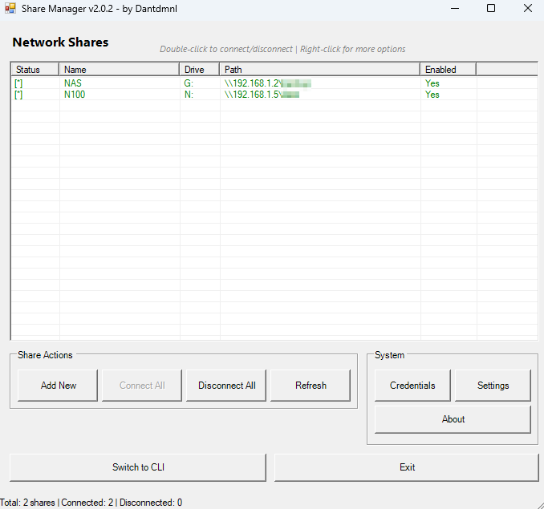

# Share Manager



## Description
Easily manage and map network shares using this PowerShell script with support for both CLI and GUI interfaces. Share Manager is designed for end users who frequently access shared folders on a NAS or file server, providing a simple interface with persistent settings.

## Features
- **Configure and store NAS/share settings** including hostname, path, drive letter, and credentials.
- **Toggle between CLI and GUI mode** with persistent startup preference.
- **Securely save credentials** and avoid repeated authentication prompts.
- **Map or unmap the configured share** with one click or command.
- **Test connectivity to the NAS/share** before attempting to map.
- **Review and modify preferences** at any time.
- **Log file for troubleshooting** and activity tracking.
- **Setup wizard** for first-time use.
- **No administrator permissions required.**

## Prerequisites
- Windows OS with PowerShell 5.1 or higher.
- A reachable NAS or network share location.
- Script execution policy must allow running scripts:
  ```powershell
  Set-ExecutionPolicy -Scope CurrentUser -ExecutionPolicy Bypass
  ```

## Usage
### Method 1: Download and Run the Script Locally

1. **Download the Script**
   - Visit the [releases tab](https://github.com/Dantdmnl/Share_Manager/releases) on the GitHub repository.
   - Download the latest version of the `Share_Manager.ps1` file.

2. **Run the Script**
   - Locate the downloaded file on your computer.
   - Right-click the file and select **Run with PowerShell**.

3. **Follow the Prompts**
   - The script will provide a menu to guide you through mapping your share, saving preferences, or switching modes.

### Method 2: Create a Desktop Shortcut

1. **Create a Shortcut**
   - Right-click on your Desktop > New > Shortcut.
   - Enter the following as the location:
     ```
     C:\Windows\System32\WindowsPowerShell\v1.0\powershell.exe -ExecutionPolicy Bypass -STA -File "C:\YourFolder\Share_Manager.ps1"
     ```
     (be sure to replace YourFolder with your path)

2. **Customize the Shortcut (Optional)**
   - Name it something like `Share Manager`.
   - Set a custom icon if desired.

3. **Run the Shortcut**
   - Double-click the shortcut to launch the script in your preferred mode (CLI or GUI).

## Notes
- Settings are stored in the `%USERPROFILE%\AppData\Roaming\Share_Manager\config.json` file.
- Log output is stored in `%USERPROFILE%\AppData\Roaming\Share_Manager\Share_Manager.log`.
- Use the Preferences menu to update paths, or behavior at any time.

## License
This project is licensed under the MIT License. See the `LICENSE` file for details.

## Author
Developed by **Dantdmnl**.
